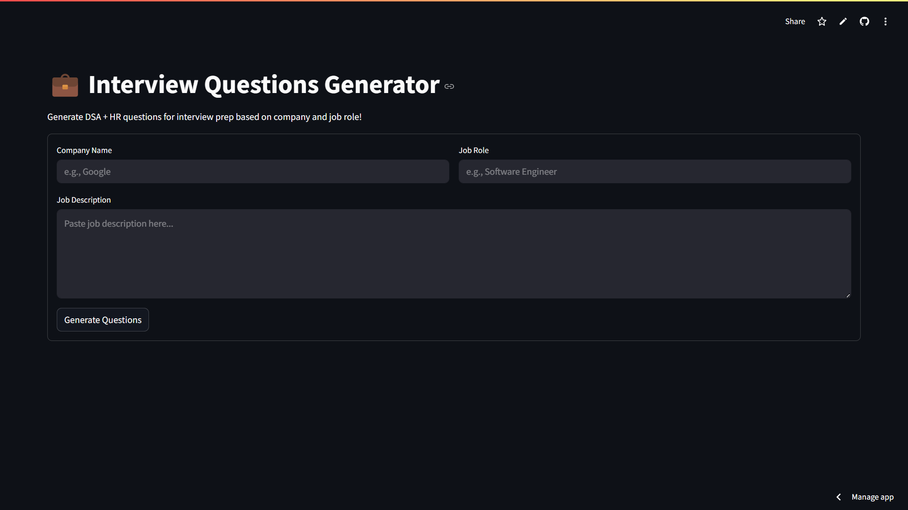
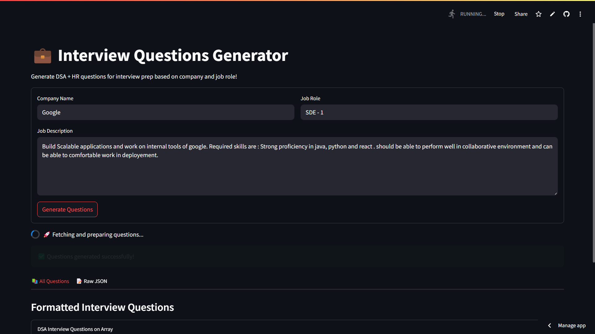
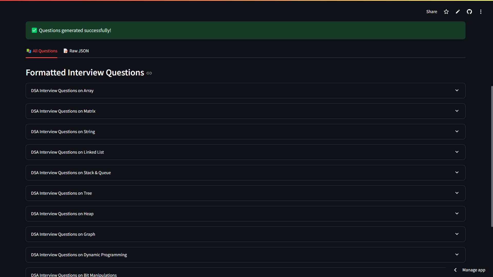

# AI Interview Question Generation System

**Version:** 1.0.0

## Description
A smart system that automatically generates interview questions based on a given topic or domain using AI models (e.g., GPT-based models or custom fine-tuned models).

---

## Features
- ✅ Generate customized interview questions from user-specified topics
- 🎯 Difficulty levels: Easy, Medium, Hard
- 📝 Option to generate MCQs, subjective, or coding questions
- 📄 Export questions as PDF or CSV
- 🌐 Simple web-based UI (built with Streamlit)

---

## Setup Instructions

1. **Clone the repository:**
    ```bash
    git clone https://github.com/your-username/ai-interview-question-generator.git
    cd ai-interview-question-generator
    ```

2. **Create a virtual environment:**
    ```bash
    python -m venv venv
    source venv/bin/activate    # On Windows: venv\Scripts\activate
    ```

3. **Install dependencies:**
    ```bash
    pip install -r requirements.txt
    ```

4. **Add your GROQ API Key (or your model API key) in `.env` file:**
    ```env
    GROQ_API_KEY=your-api-key-here
    ```

5. **Run the application:**
    ```bash
    streamlit run app.py
    ```

---

## Screenshots

- **Home Page:**
  
  

- **Loading:**
  
  

-  **Results:**
  
  

---

## Project Structure
ai-interview-question-generator/
├── app.py
├── requirements.txt
├── .env
├── README.md
├── assets/
│   ├── home.png
│   └── generated_questions.png
├── utils/
│   └── question_generator.py

---

## Requirements
- Python 3.8+
- OpenAI / Huggingface API Access
- Streamlit
- python-dotenv

---

## Future Improvements
- 🌍 Add support for multiple languages
- 🤝 Integration with ATS (Applicant Tracking Systems)
- ⚙️ Admin panel to manage question templates


